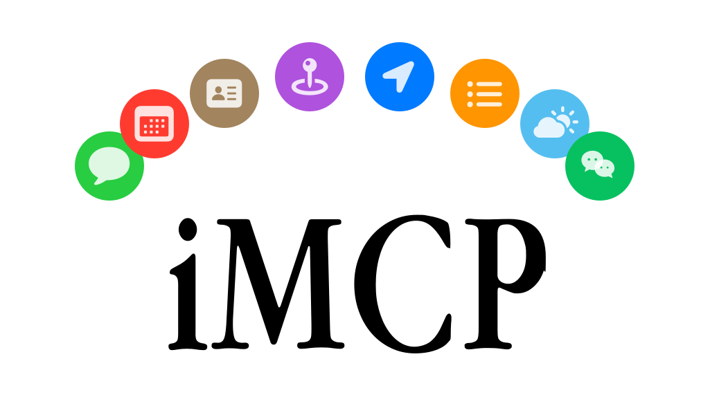
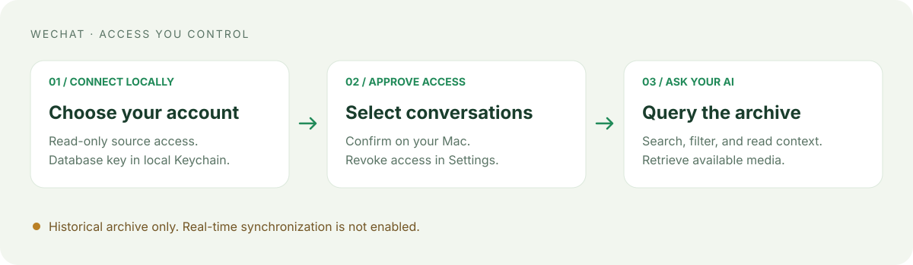

<picture>
  <source media="(prefers-color-scheme: dark)" srcset="Assets/hero-dark.svg">
  <source media="(prefers-color-scheme: light)" srcset="Assets/hero-light.svg">
  
</picture>

# iMCP

A macOS menu-bar app that connects your everyday apps to AI clients through the
[Model Context Protocol (MCP)](https://modelcontextprotocol.io).
Choose the services and tools you want to share, and approve client connections on your Mac.

This is the **WeChat development fork** of [mattt/iMCP](https://github.com/mattt/iMCP).
It adds authorized historical WeChat message queries and media access to the macOS services.

> [!IMPORTANT]
> **WeChat real-time synchronization is not enabled.** Historical queries use the
> local archive and must not be treated as a live view of your messages.
> See the [implementation status](Docs/WeChat/IMPLEMENTATION.md) for verified
> capabilities and remaining limitations.

## Capabilities

| Service | What you can do |
| --- | --- |
| **WeChat** | Find authorized conversations, search historical messages, filter by time/member/type, retrieve context and available media. |
| Calendar | List calendars, fetch events, and create or delete events. |
| Contacts | Search, list, create, and update contacts. |
| Messages | Read iMessage history after granting access to its database. |
| Capture | Capture screen content with the required macOS permission. |
| Location & Maps | Get your location, search places, explore nearby points of interest, plan routes, and generate maps. |
| Reminders | Work with reminder lists and reminders. |
| Phone & Shortcuts | Use the available phone and Shortcuts tools. |
| Weather | Available only in builds configured with the required WeatherKit capability; disabled by the local WeChat build script. |

Services may require macOS permissions or additional setup.
The exact tool inventory depends on the build and your enabled services/tools.

## WeChat


Bring selected conversations into your AI workflow without granting access to every chat.
For example, after authorizing a group you can ask:

- “Summarize last week's discussions in this group.”
- “Find the files and links shared by this member in August.”
- “Show the messages around this search result.”

These are example requests, not captured client responses. Results depend on the
authorized archive and the tools supported by your client.



### Set up an account

1. Build this fork using the instructions below, open the app, and choose
   **Settings → WeChat** from its menu-bar menu.
2. Click **选择包含 db_storage 的微信账号目录** and select the current account's directory.
3. Enter an existing 64-character hexadecimal database key and choose
   **保存到 Keychain 并连接**. The key stays in the local Keychain; do not put it in a chat,
   issue, command argument, or environment variable.
4. Click **刷新状态**. Check source availability and archive/index status.
   A readable source does not mean real-time synchronization is running.
5. Under **持久授权**, enter a group or contact name and click **查找并授权**.
   Confirm the specific conversation in the local approval dialog.
6. Wait for historical indexing to finish, then enable **WeChat** in the service list
   and connect your MCP client.

If you do not have a key, the existing Settings page can generate a one-time
Terminal extraction command. That workflow requires user-managed SIP changes and
restarts WeChat. Read its instructions, restore SIP after extraction, and keep
keys out of shared logs. This development build does not manage SIP for you.

### Optional image access

For images that need the account-specific image key, use
**选择图片配置 config.ini（只读）** in Settings → WeChat.
Select the current account's file under
`app_data/radium/ilink/…/kvcomm/config.ini`.

Only the chosen file receives read-only authorization. You can revoke it in the
same section. Image configuration is optional for text queries.
Media availability depends on the message and format; unsupported or unavailable
media returns an explicit error. A configured image key is not a guarantee that
every image can be decoded.

### WeChat tools

| Tool | Purpose |
| --- | --- |
| `wechat_status` | Check source compatibility, archive storage, and readiness. |
| `wechat_find_conversations` | Find already-authorized conversations. |
| `wechat_request_access` | Ask the local user to approve a conversation. |
| `wechat_list_members` | Page through member IDs and observed names. |
| `wechat_get_messages` | Read archived messages with combined filters. |
| `wechat_search_messages` | Search the indexed archive by keyword and filters. |
| `wechat_get_message_context` | Retrieve messages around an authorized message. |
| `wechat_get_updates` | Page through archive additions; check live-sync readiness first. |
| `wechat_get_media` | Retrieve an available temporary media resource. |

Time, member, type, and keyword filters can be combined. Follow returned cursors
without changing the query. Text search does not include OCR or speech transcription.
Observed member names are not a verified history of current nicknames.

### Access and retention

- The WeChat source database is opened read-only.
- Approved conversations create a **persistent local historical archive**.
  The archive preserves first-observed content, including content later recalled or
  removed from the source.
- Revoking a conversation blocks client access while retaining its local archive.
  **彻底清除** deletes its local archive after confirmation; it does not modify WeChat.
- Media resources are temporary and recheck authorization.
- AI clients may send tool results to their model provider. Review the client you
  connect and authorize only the conversations you want it to access.

## Build this fork

The current development branch is `codex/wechat-integration`.
The backend at `Backends/WeChat` is a pinned Git submodule of
[NytePlus/wx-cli](https://github.com/NytePlus/wx-cli), forked from
[pandorafuture/wx-cli](https://github.com/pandorafuture/wx-cli).

Use an Apple Silicon Mac with macOS 15.3 or later, Xcode, the Rust toolchain, and a
valid Apple Development signing identity. Native macOS is required for app
signing, sandbox, Keychain, and permission validation.

```sh
git clone --recurse-submodules --branch codex/wechat-integration https://github.com/NytePlus/iMCP.git
cd iMCP

# For an existing checkout:
git submodule update --init --recursive

# Choose your installed Apple Development identity:
security find-identity -v -p codesigning
SIGNING_IDENTITY='Apple Development: Your Name (TEAMID)' bash Scripts/build-wechat.sh
```

The script builds the Swift app, Rust backend, and restricted FFmpeg helpers,
applies the pinned MCP SDK compatibility patch, and signs the bundle.
Outputs are `dist/iMCP.app` and `dist/iMCP-WeChat.zip`.
They are locally signed, **not notarized**, and are not installed automatically.
Quit another iMCP instance before opening the staged app.

The upstream website download and Homebrew cask install upstream iMCP;
they do **not** install this fork's WeChat integration.
Automatic upstream updates are disabled in this build.

See [build and implementation notes](Docs/WeChat/IMPLEMENTATION.md) and
[repository/submodule workflow](Docs/WeChat/REPOSITORIES.md).

## Connect an MCP client

1. Open this fork's app and enable the MCP server from the menu bar.
   Its filled apple icon indicates that the server is enabled; the outline indicates disabled.
2. Enable the desired services. macOS may ask you to grant access.
3. Choose **Copy server command to clipboard** to get this app bundle's actual
   `imcp-server` path.
4. Add that executable as a **stdio** MCP server in your client.
5. Approve the incoming connection in iMCP.

For clients using a JSON MCP configuration, the entry has this shape.
Replace the example path with the command copied from your app:

```json
{
  "mcpServers": {
    "iMCP": {
      "command": "/absolute/path/to/iMCP.app/Contents/MacOS/imcp-server"
    }
  }
}
```

For Claude Desktop, **Configure Claude Desktop** in iMCP's menu offers a local
confirmation dialog and preserves existing server entries.
Other clients can use the same bundled executable; the configuration location
depends on the client.

Use **Settings → Services** to enable or disable individual tools.
Use **Settings → General** to manage trusted clients and launch at login.
Trusted client names are self-reported, not verified identities.

## Architecture and development

The SwiftUI app manages permissions and services. The bundled CLI bridges stdio
MCP requests to the app through local Bonjour discovery.
The WeChat service talks to its Rust child over private stdin/stdout frames.
The backend manages the authorized local archive and on-demand media access.

- [App](App/) — macOS UI, service permissions, and MCP tools.
- [CLI](CLI/) — stdio bridge and discovery.
- [WeChat backend](Backends/WeChat/) — archive, queries, authorization, and media.
- [WeChat test plan](Docs/WeChat/TESTS.md) — acceptance criteria and known gaps.
- [MCP connection notes](Docs/WeChat/CODEX-CONNECTION.md) — pinned SDK compatibility fix.

To run the backend regression suite:

```sh
cargo test --manifest-path Backends/WeChat/Cargo.toml --locked -p imcp-wechat -p wx-db
```

### Artwork

The apple mark is original vector artwork shared by the application icon,
menu-bar icons, and README headers. The WeChat workflow is an explanatory diagram,
not an application screenshot.

Regenerate the icon sizes and README artwork on macOS:

```sh
swift Scripts/generate-brand-assets.swift
```

## Acknowledgments and license

This fork builds on [mattt/iMCP](https://github.com/mattt/iMCP),
[wx-cli](https://github.com/pandorafuture/wx-cli), the
[Swift MCP SDK](https://github.com/modelcontextprotocol/swift-sdk),
[Madrid](https://github.com/mattt/Madrid), and
[Ontology](https://github.com/mattt/Ontology).
Thanks to the upstream authors and contributors, including Christopher Sardegna
for the iMessage typedstream work.

iMCP and the wx-cli backend retain their MIT licenses.
See [LICENSE.md](LICENSE.md) and [the backend license](Backends/WeChat/LICENSE).
The packaged FFmpeg helpers include their LGPL notices, source archive, and rebuild script.

iMessage and WeChat belong to their respective trademark owners.
This project is not affiliated with or endorsed by Apple or Tencent.
